# EBAZ4205板载资源介绍

[TOC]

矿难后闲鱼上`EBAZ4205`控制板泛滥，它出自`翼比特E9+`矿机。它的老版控制卡`EBAZ4203`配置与其基本一样。

下面一大坨都是计算卡，上面一小块才是控制板

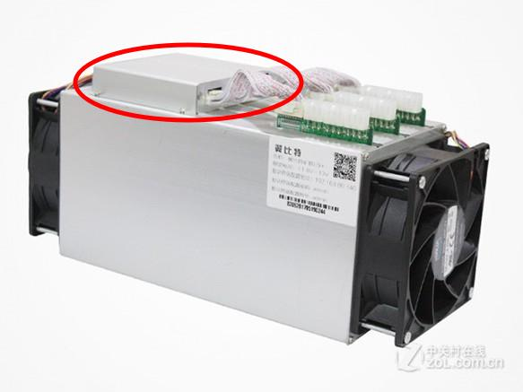

## 控制板概览

控制板外观
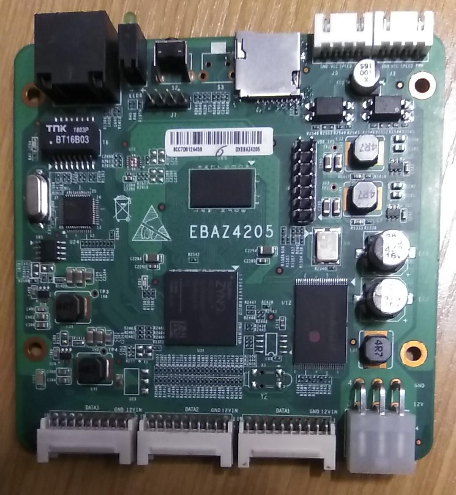

### 控制板规格表

| 主控   | XC7Z010CLG400-1 (dual-core ARM A9 / ARTIX-7)       |
| ------ | -------------------------------------------------- |
| 内存   | 128MB x 16bit DDR3-800 (EM6GD16EWKG / MT41K128M16) |
| nand   | 128MB SLC NAND FLASH                               |
| 以太网 | 百兆网卡，IP101GA                                  |
| 供电   | 12V                                                |
| 其他   | TF卡，UART1，2个风扇口，14针jtag，3个20pin IO口    |

  > * XILINX XC7Z010-1CLG400I soc 包含两个硬核ARM A9，以及ARTIX-7逻辑。
  > * 128M x 16 bit DDR3 CLK800Mhz
  > * 128M字节 NAND FLASH
  > * PS 
  >   * 33.333Mhz osc
  >   * MII PHY
  >   * LED x 2
  >   * Key x 2
  >   * SDIO
  >   * UART
  >   * NAND FLASH
  > * PL
  > 	* 排针 x 3
  >
  > 注意PHY接在FPGA上。板子电源使用12v，默认板子从三个排针接入电，J4排座没有焊二极管，可以短路后使用J4供电。板子还需要把UART JTAG排针坐焊上。暂时不用SD卡和PHY。

## 开发环境

### SOC启动配置

ZYNQ系列的SOC集成了双核ARM Cortex-A9和FPGA。ZYNQ 7010处理器主频可以到约600MHz，FPGA有约28K个LE。

整个SOC分为`PS`（processing system）和`PL`（programmable logic）两部分。

* PS包括处理器、片上AMBA总线、存储控制器、部分外设以及固定的IO口；

* PL就是FPGA；


ZYNQ的PS部分可以抛开PL部分而独立运行，因为PS的外设都默认绑定了一些IO口（`MIO`），内存控制器之类的IO口还是不可更改的，这时候就可以像开发其他ARM SOC那样去玩ZYNQ。MIO是有限的，一些外设端口冲突的话可以通过`EMIO`绕道PL将其引出，这时候就需要管PL部分了。

ZYNQ的启动分为三步：

- `BOOT ROM`，根据引脚配置选择从哪里启动，如QSPI、nand/nor flash、SD卡等。将`FSBL`（first stage bootloader）加载到片上内存里。7010的片上内存有256k。
- `FSBL`，初始化更多的MIO口，初始化DDR，还可以初始化PL部分，然后将应用程序搬到DDR中。初始化部分由vivado直接生成，即那个上万行的`ps7_init.c`。FSBL可以直接用Xilinx SDK的例子工程，相当于这些工作都可以点点鼠标就完成了。
- `应用程序`。可以直接是用户的应用程序，也可以是又一个loader，比如uboot之类的，剩下的事情就由程序员自己做决定了。

> 应当指出，FSBL相当于是uboot SPL的地位。在Xilinx uboot工程中，那个上万行的初始化c程序就编译进SPL中去了，所以如果用SDK的FSBL就不需要uboot的SPL了。
>
> ZYNQ SOC启动过程以ARM为主，上电后硬件读取PS端IO口确定从NAND、QSPI-FLASH、SD Card还是JTAG启动。
>
> 板子默认从NAND启动，为了软件调试和下载NAND，须从JTAG启动

#### SD启动

这块板子的`R2577`和`R2584`电阻用于配置启动设备。把`R2584`焊到`R2577`上，将原来nand启动改为SD卡启动。

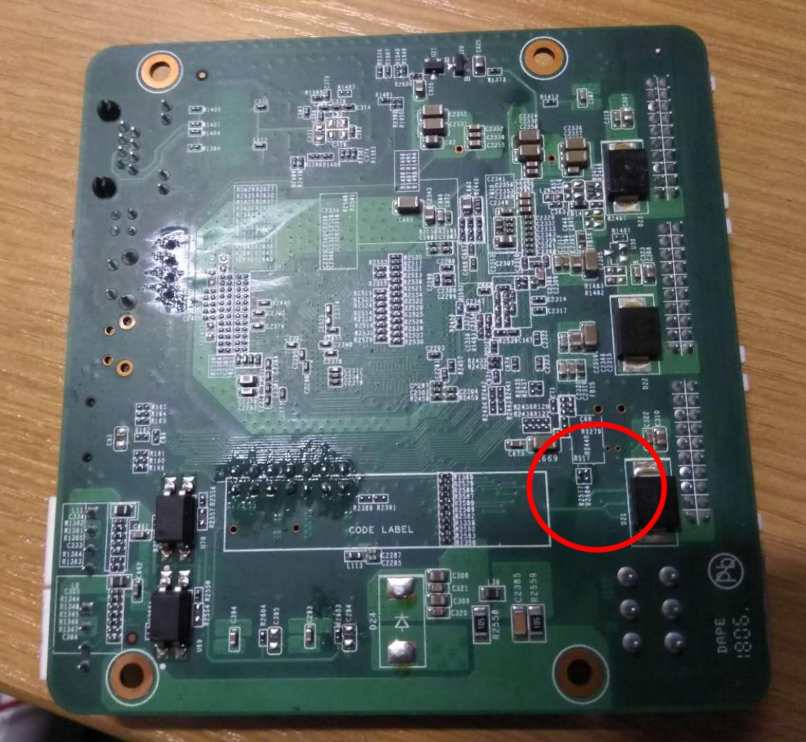

#### JTAG启动

将电阻R2578靠近NAND的一端接到地。

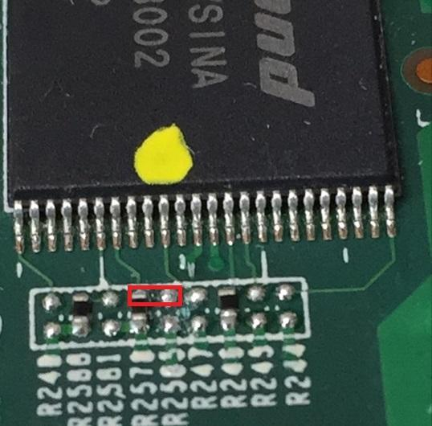

### Vivado操作流程

利用Xilinx的开发环境，helloworld工程完全可以用鼠标操作出来，一行代码都不用写。。

#### 首先新建个工程

一直next到选择芯片。选`xc7z010clg400-1`

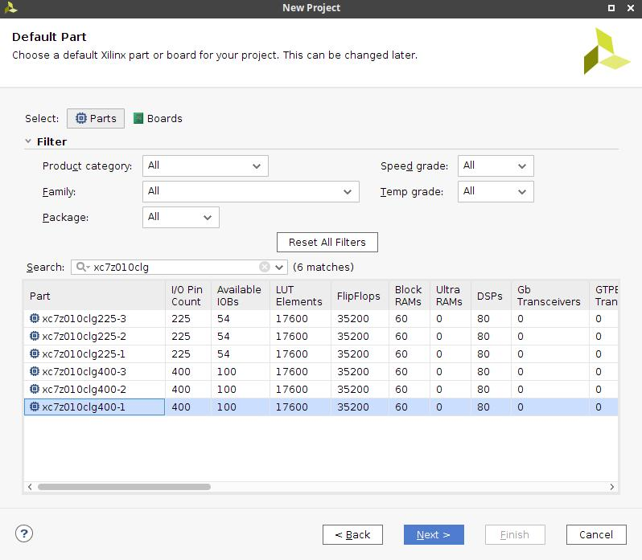

接下来就顺着左边栏`Flow Navigator`进行操作。

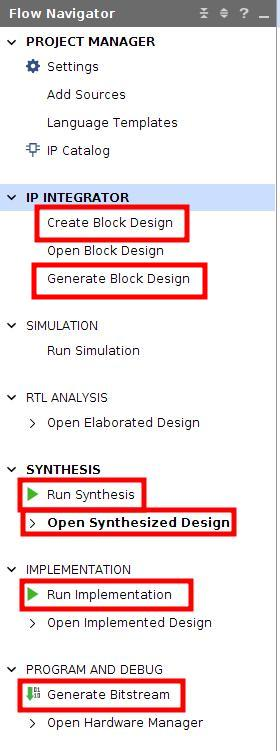

#### Create Board Design

点加号添加`ZYNQ7 Processing System`:

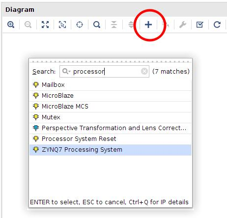

双击出来的zynq7 processing system蓝框框，配置PS系统：

* 添加nand控制器，默认就行了：

  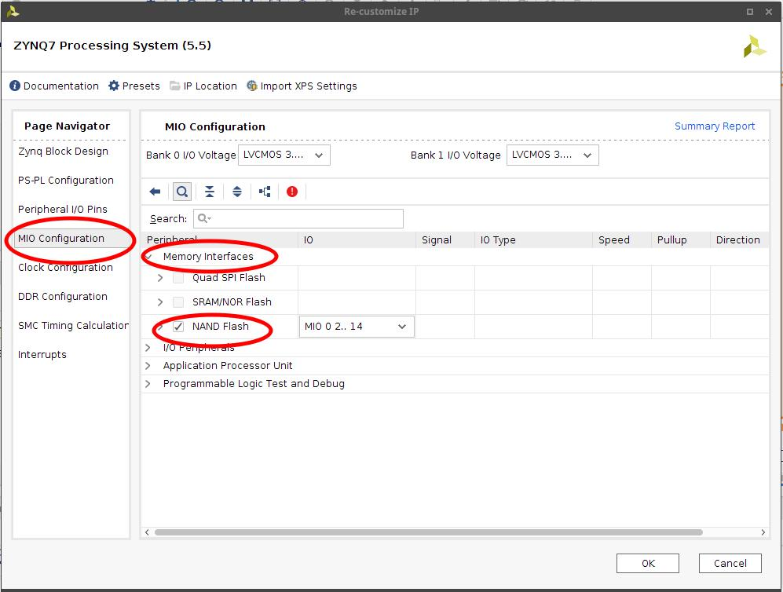

* 添加MIO设置。勾上ENET0、SD0、UART1。注意引脚配置：

  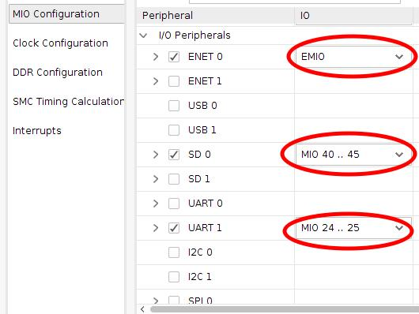

* 设置外设时钟。把网口改成百兆的：

  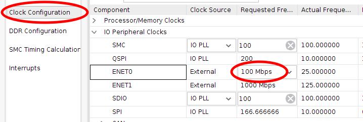

* 设置DDR。MT41K128M16有默认参数配置：

  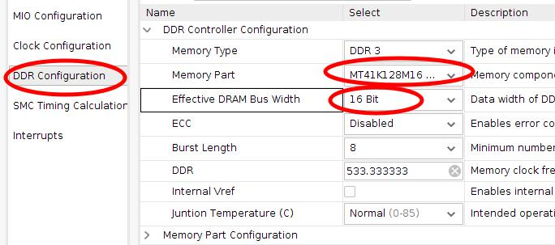

* 网口设定

  因为板子的网口通过EMIO引出，所以我们需要一个个手动分配引脚。但是这个IP是GMII千兆网口，TX RX有8位，而百兆网卡用的MII接口TX RX只有4位，**必须显式地加两个concat模块来将8位转为4位**，否则多余的引脚引出了但是不分配IO口，最后生成bitstream时候会报错。

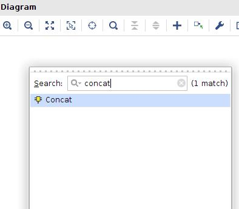

将GMII的TX、RX引到各自的concat模块处，将GMII其他引脚以及MDIO引出：右键点击`Make External`

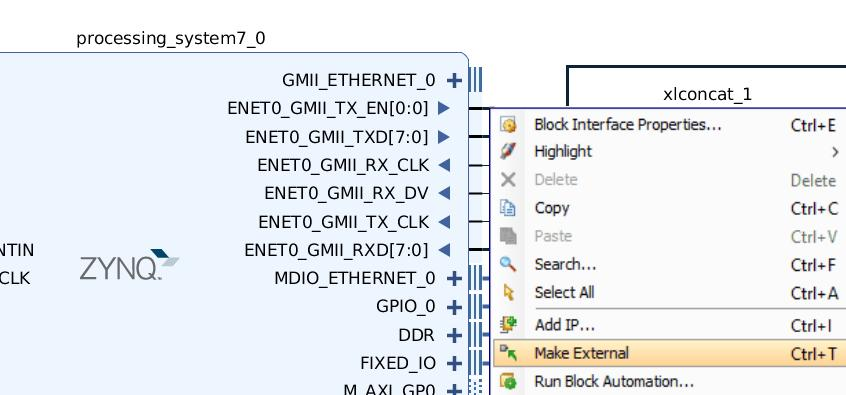

将`FCLK_CLK0`跟`M_AXI_GP0_ACLK`连起来，最后点击上方栏的`Run Block Automation`完成剩下的工作。


完成后的效果：

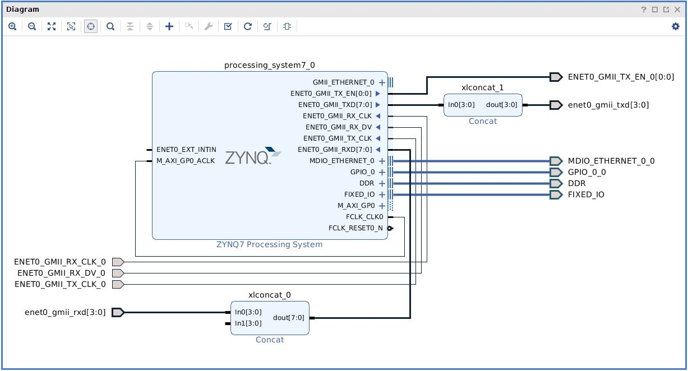

#### Generate Block Design(左边栏)

先`Generate Block Design`，然后右键`Source`框下面的bd文件，`Create HDL Wrapper`：

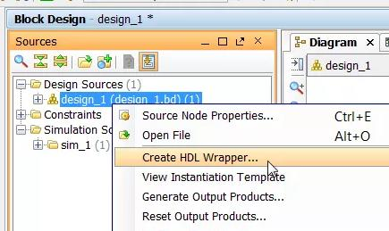


#### Run Synthesis(左边栏)

先综合一次，然后打开`Open Synthesized Design`->`Constraint Wizard`，分配引脚。这时需要新建一个constraint文件。

将网口的引脚都设置为`LVCMOS33`电平，然后逐个分配引脚。。。

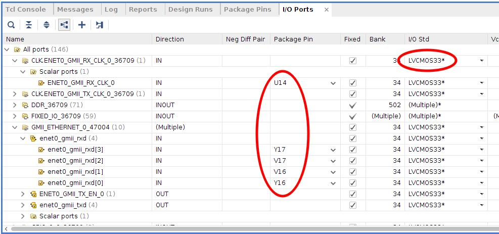

设置完成后`Ctrl-S`保存，约束文件生成如下：

```
set_property IOSTANDARD LVCMOS33 [get_ports ENET0_GMII_RX_CLK_0]
...
set_property PACKAGE_PIN U14 [get_ports ENET0_GMII_RX_CLK_0]
set_property PACKAGE_PIN U15 [get_ports ENET0_GMII_TX_CLK_0]
set_property PACKAGE_PIN W19 [get_ports {ENET0_GMII_TX_EN_0[0]}]
set_property PACKAGE_PIN W18 [get_ports {enet0_gmii_txd[0]}]
set_property PACKAGE_PIN Y18 [get_ports {enet0_gmii_txd[1]}]
set_property PACKAGE_PIN V18 [get_ports {enet0_gmii_txd[2]}]
set_property PACKAGE_PIN Y19 [get_ports {enet0_gmii_txd[3]}]
set_property PACKAGE_PIN W16 [get_ports ENET0_GMII_RX_DV_0]
set_property PACKAGE_PIN W15 [get_ports MDIO_ETHERNET_0_0_mdc]
set_property PACKAGE_PIN Y14 [get_ports MDIO_ETHERNET_0_0_mdio_io]
set_property PACKAGE_PIN Y16 [get_ports {enet0_gmii_rxd[0]}]
set_property PACKAGE_PIN V16 [get_ports {enet0_gmii_rxd[1]}]
set_property PACKAGE_PIN V17 [get_ports {enet0_gmii_rxd[2]}]
set_property PACKAGE_PIN Y17 [get_ports {enet0_gmii_rxd[3]}]
```

然后再综合一次。

#### 左边栏Run Implementation 和 Generate Bitstream

要跑一段时间。

#### 输出设计

`File`->`Export`->`Export Hardware`

记得勾上`Include Bitstream`。

#### 进入SDK

`File`->`Launch SDK`

### SDK操作流程

#### 首先需要新建FSBL。

`File`->`New`->`Application Project`，Next到`Templates`，选`Zynq FSBL`：

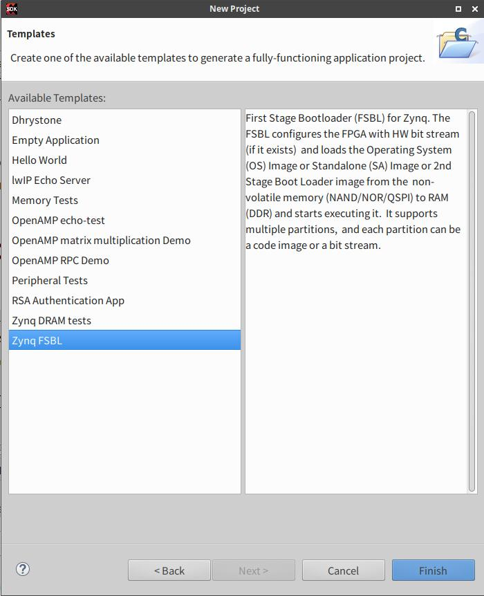

然后它会自动开始编译。。。

#### 然后才新建helloworld。。

`File`->`New`->`Application Project`，Next到`Templates`，选`Hello World`。它也会自动开始编译，不出意外的话就完事了。

#### 最后生成启动文件BOOT.bin

左边栏右键helloworld工程，`Create Boot Image`。可以看到这个启动文件包括了三部分：

- fsbl
- bitstream
- 应用程序

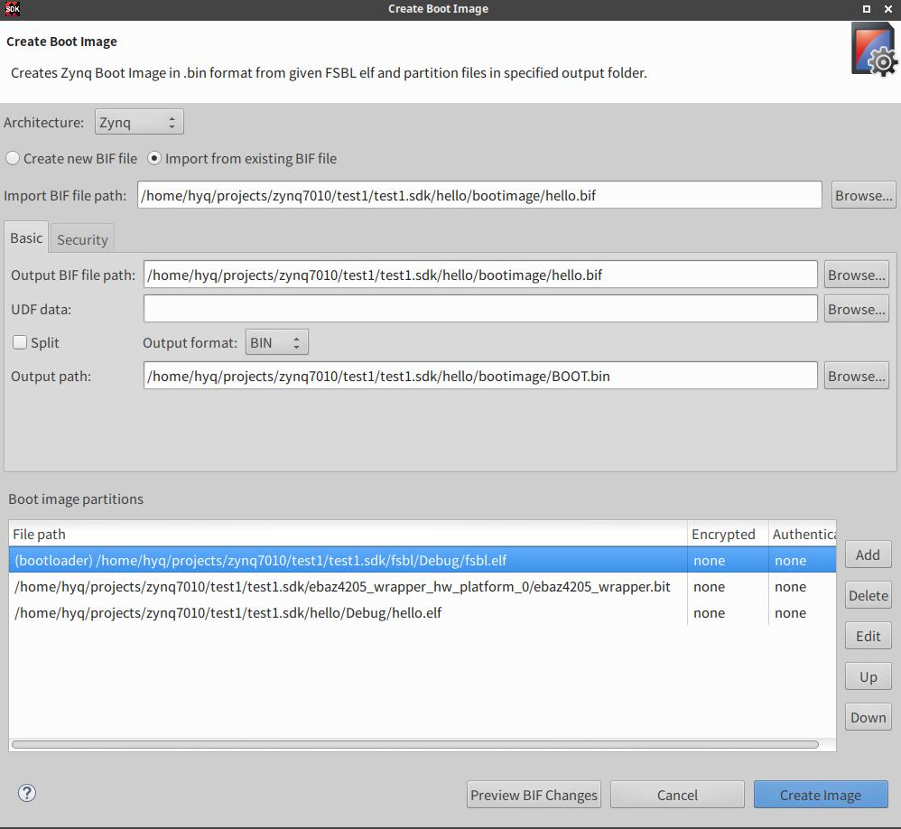

#### 点亮板子

将一张SD卡格式化为fat文件系统，将`bootimage/BOOT.bin`丢进去，插上电就能启动了。


#### 测试网口

SDK里面新建`lwIP Echo Server`工程，等它编译完，生成BOOT.bin，拷到SD卡里。插好网线，在终端中`telnet`它的7号端口，输入一行，回车，然后它就将你输入的东西返回来了。。。

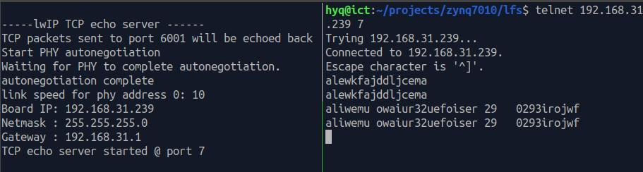

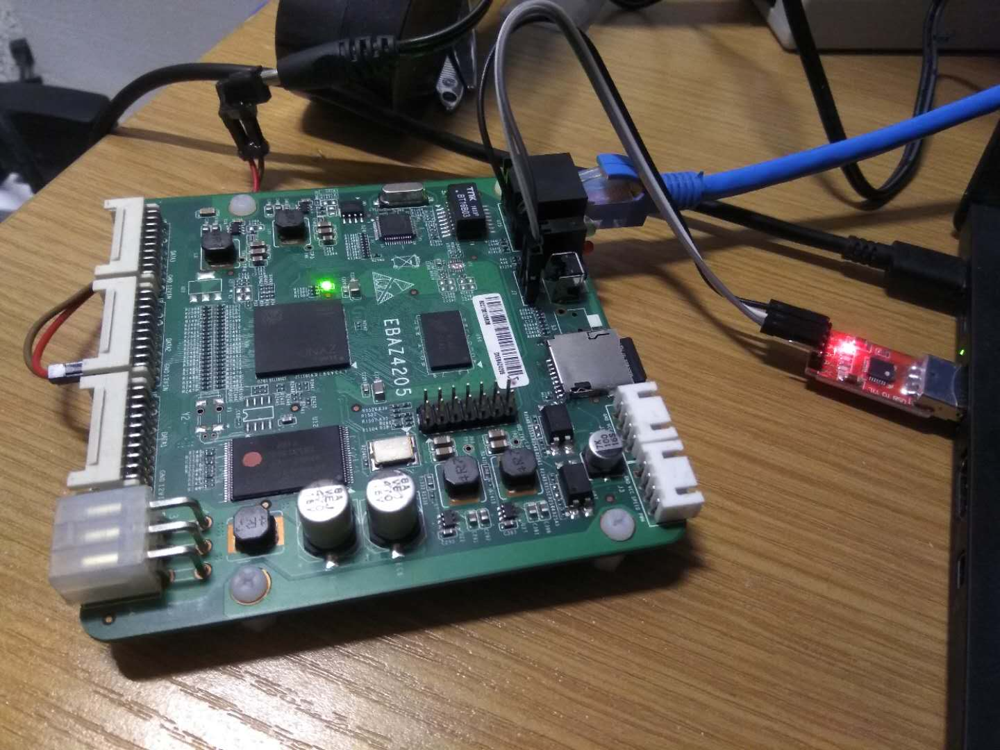

